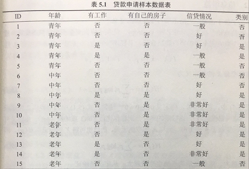

# 熵的定义
### 在信息论与概率统计中，熵是表示随机变量不确定性的度量。设 X 是一个取有限个值的离散随机变量，其概率分布为 =p_{i},i=1,2,...,n) 则随机变量 X 的熵定义为  =-\sum_{i=1}^{n}p_{i}logp_{i}) 其中对数通常以 2 或者 e 为底，这是熵的单位分布成为比特或者纳特。由定义可知，熵只依赖 X 的分布，与其取值无关，所以也可以将 X 的熵记为 H(p),即  =-\sum_{i=1}^{n}p_{i}logp_{i}) 熵越大，随机变量的不确定性就越大。

# 条件熵
### 设有随机变量 (X,Y),其联合概率分布为=p_{ij},i=1,2,...n;j=1,2,...,m) 条件熵 H(Y|X) 表示在已知随机变量 X 的条件下随机变量 Y 的不确定性。随机变量 X 给定的条件下随机变量 Y 的条件熵 H(Y|X)，定义为 X 给定条件下 Y 的条件概率分布的熵对 X 的数学期望 =\sum_{i=1}^{n}p_{i}H(Y|X=x_{i})) 这里，,i=1,2,...,n.)
### 当熵和条件熵中的概率是由数据估计得到时，所对应的熵和条件熵分别为经验熵和经验条件熵。
# 信息增益
### 信息增益（information gain）表示得知特征 X 的信息而使得类 Y 的信息的不确定性减少的程度。
### 特征 A 对训练数据集 D 的信息增益 g(D,A) ,定义为集合 D 的经验熵 H(D)与特征 A 给定条件下 D 的经验条件熵H(D|A)之差，即=H(D)-H(D|A))
# 信息增益比
### 特征 A 对数据集 D 的信息增益比) 定义为其信息增益 g(D,A) 与数据集 D 关于特征 A 的值的熵) 之比，即=\frac{g(D,A)}{H_{A}(D)})  =\sum_{i=1}^{n}\frac{|D_{i}|}{|D|}log_{2}\frac{|D_{i}|}{|D|})  其中，n是特征 A 取值的个数。 

# [例] 对下表所给的训练数据集 D ,根据信息增益准则选择最优特征

### 解：首先求数据集 D 的经验熵 H(D)
### $$ \begin{equation} \begin{split}  H(D)&=-\sum_{i}^{n}p_{i=1}log_{2}p_{i} \\ &=-(\frac{9}{15}log_{2}\frac{9}{15}+\frac{6}{15}log_{2}\frac{6}{15}) \\ &=-0.971 \end{split} \end{equation}$$
### 然后求各个特征对数据集 D 的经验条件熵 H(D|A)。分别以$A,B,C,E $ 表示年龄、是否有工作、是否有自己的房子，信贷情况4个特征，则 $$ \begin{equation} \begin{split}  H(D|A) &=\sum_{i=1}^{n}p_{i}H(Y|A=A_{i}) \\ &=\frac{5}{15}H(Y|A=A_{1})+\frac{5}{15}H(Y|A=A_{2})+\frac{5}{15}H(Y|A=A_{3}) \\ &=\frac{5}{15}[(-\frac{3}{5}log_{2}\frac{3}{5}-\frac{2}{5}log_{2}\frac{2}{5})+(-\frac{2}{5}log_{2}\frac{2}{5}-\frac{3}{5}log_{2}\frac{3}{5})+(-\frac{4}{5}log_{2}\frac{4}{5}-\frac{1}{5}log_{2}\frac{1}{5})] \\ &=-0.888 \end{split} \end{equation}$$ 

### 依次求出其他特征的条件熵 $$H(D|B)=0.647 $$ $$H(D|C)=0.551 $$ $$H(D|E)=0.608 $$  最后求各个特征的信息增益 $g(D|A)=H(D)-H(D|A)$  所以有  
$$ g(D|A)=0.083 $$ $$g(D|B)=0.324 $$ $$g(D|C)=0.420 $$ $$g(D|E)=0.363 $$ 
### 故特征C，即有自己的房子作为最优特征。
